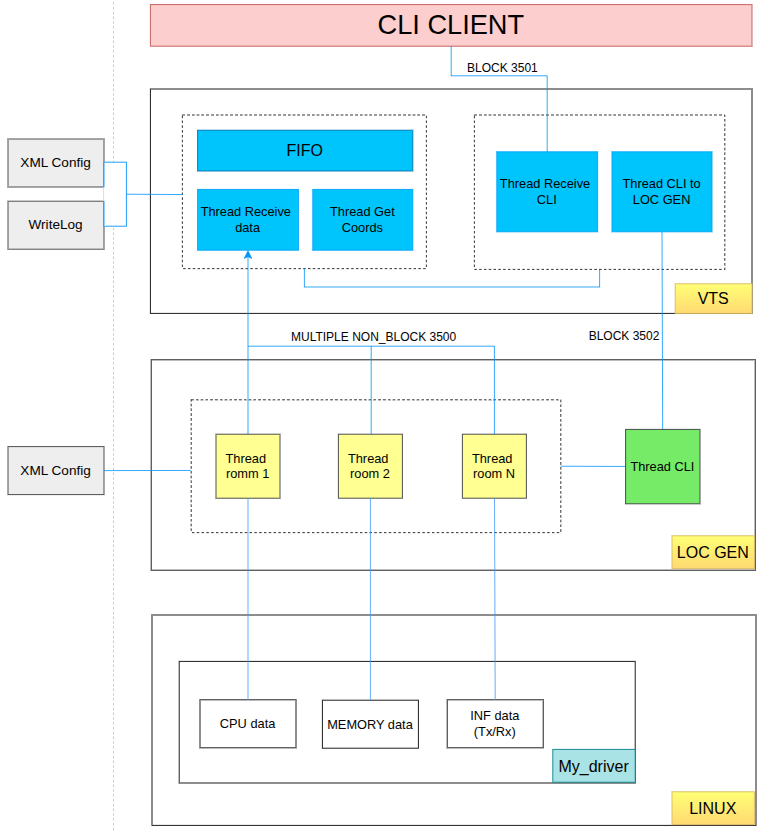

## Process-Monitor
## I. Overview
The system is designed to monitor hardware/software resources (CPU, memory, I/O, network) on an embedded Linux board. A remote CLI client can send commands such as START, STOP, EDIT, SHOW, DELETE... via a socket, and the system will respond with real-time monitoring data.
## II. Objectives
- Collect and record system resource statistics at a configurable interval
- Provide an interface to enable/disable monitoring through procfs (proc file system)
- Support remote control (CLI client) to start/stop monitoring tasks
- Allow multiple monitoring "rooms" to run in parallel for different resources
- Store logs for debugging and later analysis
## III. System Components
a. Kernel Driver (My Driver)
- Collects data and system statistics (CPU usage, memory usage, disk I/O, network throughput)
- Exposes data and control via procfs (/proc/sysmonitor, /proc/sysstats, /proc/sysio)
- Supports enabling/disabling monitoring through write commands (1 = enable, 0 = disable)

b. Daemon User-Space (VTS – Block 3501 & 3502)
- Monitors entries in procfs and manages monitoring threads
- Handles socket communication with remote clients
- Uses FIFO for internal data exchange (Recv data ↔ Get Coords)
- Creates threads for each “room” (Room1, Room2 … RoomN) to run multiple independent monitoring sessions
- Logs all monitoring events and results

c. CLI Client (Remote)
- Runs on another device or PC
- Connects to the daemon via TCP/UDP socket
- Sends control commands (START, STOP, EDIT, CREATE, DELETE, SHOW)
- Displays monitoring results

d. LOC GEN (Block 3502)
- Generates location/context information for monitoring data
- Acts as an intermediary between CLI commands and room/thread management
## IV. Functional Requirements
  FR1: The kernel driver must expose procfs entries for monitoring control and data access.

  FR2: Writing 1 to procfs must enable monitoring, and writing 0 must disable it.

  FR3: The daemon must run in the background and periodically read data from procfs.

  FR4: The daemon must receive CLI commands remotely via socket.

  FR5: Each monitoring session (“room”) must be independent and configurable (e.g., interval, duration).

  FR6: The system must support multiple concurrent monitoring sessions.

  FR7: The system must generate logs for client actions and monitoring data.

  FR8: The CLI client must support the following commands: CREATE | DELETE | START | STOP | EDIT | SHOW.

## V. Non-Functional Requirements

  NFR1: The system must operate with low overhead on embedded Linux.

  NFR2: The daemon must be fault-tolerant and capable of restarting.

  NFR3: Network communication must support IPv4 over both TCP and UDP.

  NFR4: Procfs must remain lightweight and must not block kernel execution threads.

  NFR5: Logs must follow a standard format and support rotation (log → log1 → log2).
## VI. Interface (Command lines)
  - help: show all supported cmd and command details

  - Create: system-monitor create {cpu-room | memory-room | inf-stats-room} [interval <int>]

  - Start: system-monitor start {cpu-room | memory-room | inf-stats-room} [interval <int>]

  - Edit: system-monitor edit {cpu-room | memory-room | inf-stats-room} interval <int> 

  - Stop: system-monitor stop {cpu-room | memory-room | inf-stats-room}

  - Delete: system-monitor delete {cpu-room | memory-room | inf-stats-room}

  - Show: system-monitor show [cpu-room | memory-room | inf-stats-room]

  - Other command: Raise an ERROR && help for all commands
	

